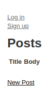

 

## Members only (Authentication)

Project based on authenticating users on a given web page.

## Built With

- Ruby
- Ruby on Rails 
- VSCode 
- Linters 

## What it does?

You can signup for the forum and, if you are, you can see the post's authors and who commented on it. If you are not logged in, you cannot see the authors.

## Getting Started

- Clone the project to your local machine;
- `cd` into the project directory;
- Run `bundle install` to install the necessary gems;
- Run `rails db:migrate` to create your database columns;
- Run `rails s` to start a server in your computer;
- In your browser address, type the following URL: [localhost:3000](localhost:3000);
- Enjoy the App and its functionalities!

## Authors

👤 **Author1**
Aremu Lucky
- Github: [@githubhandle](https://github.com/Luckyaremu)
- Twitter: [@twitterhandle](@luckyaremu)
- Linkedin: [linkedin](https://www.linkedin.com/in/lucky-aremu-24807a145/)

👤 **Author2**
Murilo Roque Paiva da Silva
Github: [@MuriloRoque](https://github.com/MuriloRoque)
Twitter: [@MuriloRoquePai1](https://twitter.com/MuriloRoquePai1)
Linkedin: [MuriloRoque](https://www.linkedin.com/in/murilo-roque-b1268741/)

## 🤝 Contributing

Contributions, issues and feature requests are welcome! Start by:

Forking the project.
Cloning the project to your local machine.
cd into the project directory.
Run git checkout -b your-branch-name.
Make your contributions.
Push your branch up to your forked repository.
Open a Pull Request with a detailed description to the development branch of the original project for a review.

## Show your support

Give a ⭐️ if you like this project!
